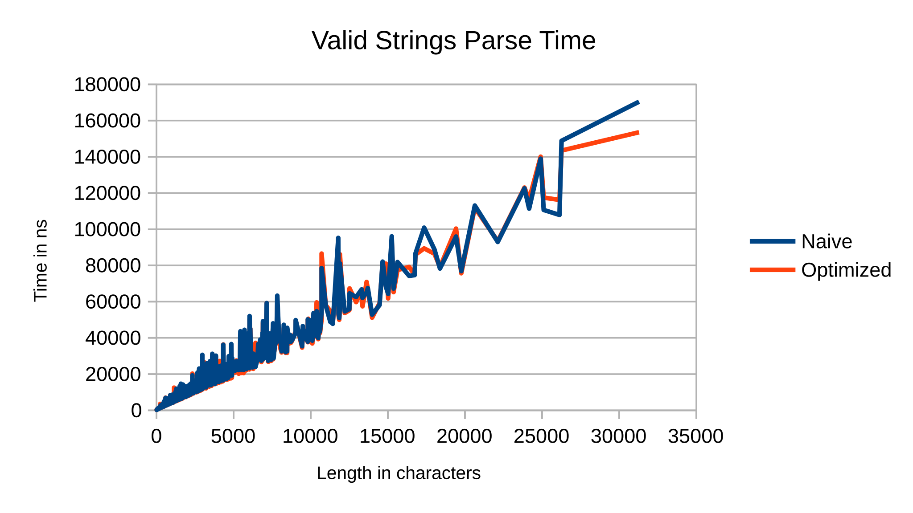
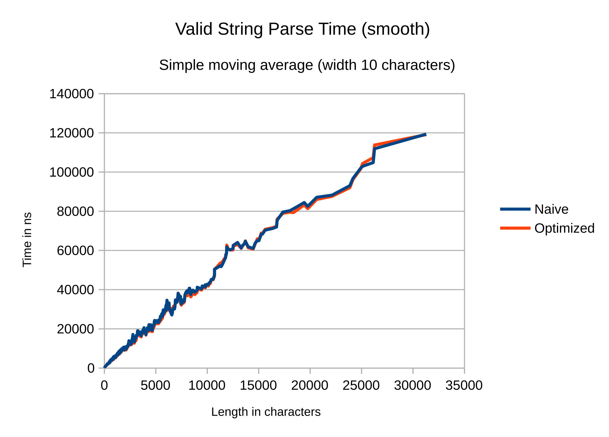
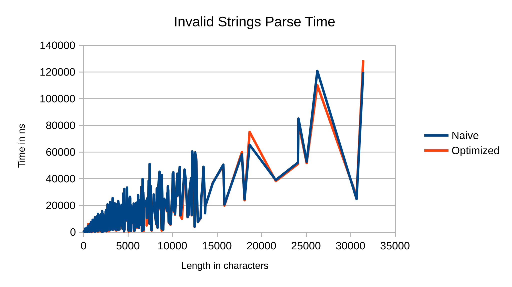
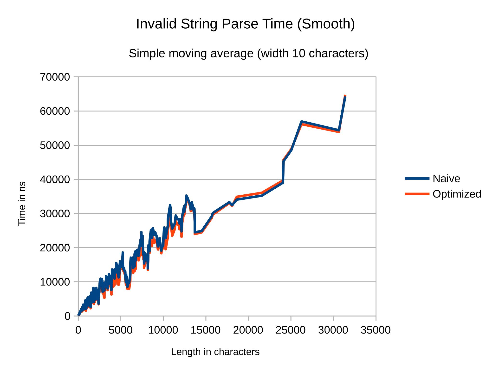

# Лабораторная работа №4 по ТФЯ. Вариант 25.

# 0. Исходная атрибутная грамматика.

$$
`
S \to abSbbS, S_1.z == S_2.z, S_0.z := S_1.z \\
S \to baaTaaa, S.z := T.z \\
T \to TaT, T_0.z := [\frac{T_1.z}{\max(1, T_2.z)}]+1\\
T \to TaT, T_0.z := \vert [\frac{T_1.z}{\max(1, T_2.z)}]-1 \vert \\
T \to bb, T.z := 3\\
S \to \varepsilon, S.z := 0 \\
`
$$

# 1. Проверка языка на КС-свойство.

Данная атрибутная грамматика имеет два одинаковых правила разбора, но с разными атрибутами.   Определим возможные значения атрибутов для одинаковых правил.

Строки вида $baaTaaa$, входящие в язык, формируются правилами грамматики без атрибутов (предикатов сравнения для валидности полученной строки не задано). Данное подмножество слов языка задаётся регулярным выражением $L_1 = baa bb(abb)^* aaa = ba(abb)^+ aaa$.

Первое правило говорит о том, что атрибут $z$ при полном раскрытии у всех регулярных компонентов $S$ должен быть одинаковым. Действительно, при полном раскрытии этого правила равенство распространяется справа налево. Если при полном разборе некоторые $S$ оказались пустыми, тогда для других $S$ $S.z = 0$.

Если считать, что два условия для одного правила ошибкой не являются, покажем, что в таком случае регулярный $S$ может принимать ограниченное число значений атрибута $z$, зависящее от длины. Попытаемся выяснить закономерность.

$T \to bb = T^0$: $T^0.z = 3$.

$T \to TaT \to bbabb = T^1$: $T^1.z \in \lbrace 0, 2 \rbrace$: $[3/3]+1 = 2$ или $| [3/3]-1| = 0$.

$T \to TaT \to TaTaT \to bb(abb)^2 = T^2$: $T^2.z \in \lbrace 0,1,2,4 \rbrace$.

$bb(abb)^3 = T^3$: $T^3.z \in \lbrace 0,1,2,3,4 \rbrace$.

$bb(abb)^4 = T^4$: $T^4.z \in \lbrace 0,1,2,3,4,5 \rbrace$.

$bb(abb)^5 = T^5$: $T^5.z \in \lbrace 0,1,2,3,4,5 \rbrace$.

Заметим, что для $T^n = bb(abb)^n$ и $T^{n+2} = bb(abb)^{n+2}$, где $n \ge 3$, существует разбор $T^{n+2} \to T^n a T^1$. Тогда, поскольку $bbabb$ может иметь нулевое значение параметра, то множество значений, которое может принимать $z$ в $T^{n+2}$, содержит значение, большее максимального во множестве значений $z$ для $T^n$, на 1 ($\max(T^{n+2}.z) := [\max(T^n.z)/1] +1$). 

С другой стороны, существует разбор $T^{n+2} \to T^0aT^{n+1}$, и тогда в множестве значений $z$ для $T^{n+2}$ есть 0 ($\min(T^{n+2}.z) := [3/2] - 1$). По индукции для $bb(abb)^n$, где $n \ge 3$, $z \in \lbrace 0,1,2, ..., [\frac{n}{2}]+3\rbrace$. 

Максимальное значение не столь важно, а важен скорее тот факт, что все регулярные $S$, кроме ограниченного числа краевых случаев, могут иметь нулевое значение атрибута. Для данного подмножества языка можно предложить КС-грамматику: 
$$
`
S \to abSbbS \\
S \to baaTaaa \\
T \to bbaT'\\
T' \to bb\\
T' \to T'aT'\\
S \to \varepsilon \\
`
$$

Краевым случаем остаётся только $T \to bb$. Его значение атрибута (3) начинает присутствовать в серии $bb(abb)^n$, начиная с $n=3$. Тогда должны потребовать, чтобы нетривиальный $T$ был не меньше $bb(abb)^3$:

$$
`
S \to abSbbS \\
S \to baaTaaa \\
T \to bb(abb)^2aT'\\
T \to bb\\
T' \to bb\\
T' \to T'aT'\\
`
$$

Объединение контекстно-свободных языков является КС.

Предположительно, данный язык не является регулярным. Аналогично лабораторной работе №3, можно показать, что языки $L_2$ и $L_3$ из объединения представляют собой правильные скобочные последовательности: $( \to ab, ) \to bb$, а язык ПСП не является регулярным. 
Пересечём с регулярным языком $(ab)^*(bb)^*$. Результатом будет язык $\lbrace(ab)^n (bb)^n \vert n \in \mathbb{N} \rbrace$. Это известный случай нерегулярного КС-языка, но покажем это на конкретном контрпримере. Пусть $w = (ab)^p(bb)^p$. Пробуем разбиение $w = xyz$, где $\vert xy\vert < p$. Это значит, что можно накачать либо $a$ в первой части слова, либо $b$, либо целые $ab$ только в первой части слова $(ab)^n$. Любые накачки либо нарушают баланс $ab$ и $bb$, либо прерывают последовательность $(ab)^n$ (в случае накачки отдельных букв в $(ab)^n$) и выводят слово из языка. Таким образом, язык, заданный атрибутной грамматикой, является КС, но не является регулярным.
# 2. "Наивный" парсер слов для языка.

Атрибутная грамматика описывает контекстно-свободный язык, который можно задать следующим образом:

$$
`
S \to S_1 \vert S_2 \vert S_3 \\
`
$$
$$
`
S_1 \to ba R aaa \\
R \to abb R \vert abb \\ 
`
$$
$$
`
S_2 \to ab S_2 bb S_2 \vert baa T aaa \vert \varepsilon \\
T \to bba T' \\
T' \to bb \vert T' a T' \\
`
$$
$$
`
S_3 \to ab S_3 bb S_3 \vert baa U aaa\\\
U \to bb (abb)^2aV \vert bb \\
V \to bb \vert VaV
`
$$

"Наивный" парсер проверяет слово на соответствие трём языкам по отдельности, и возвращает $(w \in L_1) \lor (w \in L_2) \lor (w \in L_3)$

# 3. Оптимизированный парсер. Тестирование.

Анализ выходных данных показал, что время разбора строки парсером растёт линейным образом в зависимости от длины строки (в рамках существующей интерпретации языка), что, в общем, не удивительно, учитывая, что парсер получился без обратных возвратов на произвольное расстояние: парсер способен однозначно определять ветвление $S \to abSbbS \vert  baaTaaa \vert \varepsilon$ или отклонять слово по ограниченному lookahead, а $T$ и вовсе описывается регулярным выражением. Большинство оптимизаций было уже неявным образом введено в ходе доказательства КС-свойства, главным образом -- выделение "скобок" ($ab \to ($, $bb \to )$) и регулярных частей слова. Вычислительную сложность исходного парсера можно описать как $O(3N)$ ~ $O(N)$.

Внедрённые оптимизации:

1. Заметим, что все строки, принимаемые $L_1$, принимаются либо $L_2$, либо $L_3$, поэтому парсер для $L_1$ можно пропустить.
2. Выбор между разбором $L_2$ и $L_3$ на основании префикса:
    - Если слово начинается на $b$, тогда проверяются первые 7 символов: $baabbaa.. \to L_3$ , $baabbab.. \to L_2$, иначе слово не принадлежит языку.
    - Если слово начинается на $a$, тогда аналогично проверяются первые 9 символов: $abbaabbaa.. \to L_3$, иначе проверяется сначала $L_2$, потом $L_3$ (если 9-й символ $b$, это ещё не гарантия, что язык принимается $L_2$: например, слово $ab \cdot baa(bba)^3 aa \cdot bb \cdot baabbaaa$ принимается $L_3$, но не $L_2$, из-за $T \to baabbaaa$, который может присутствовать только в $L_3$).

Асимптотическая сложность алгоритма от этих оптимизаций не изменяется ($O(2N)$ ~ $O(N)$), но тем не менее на практике это должно означать сокращение времени разбора, особенно для не входящих в язык слов.

Датасеты, содержащие сравнение времени парсинга для исходного ("наивного") парсера и оптимизированного парсера выгружаются программой в формате `.csv`.

Данные в исходном и сглаженном (методом скользящей средней) виде:

Можно заметить, что время выполнения разбора ограничено двумя прямыми сверху и снизу, причём наклон первой прямой в два раза больше, чем у второй. Это обусловлено тем, что существуют слова $\in L_2$, для которых уже не требуется проверять соответствие $L_3$, а некоторые слова нужно прочитать почти до конца, чтобы обнаружить, что они не соответствуют $L_2$, но соответствуют $L_3$, то есть их нужно разобрать дважды.

После сглаживания преимущество оптимизированного алгоритма незначительно. Это объясняется тем, что проверки, похожие на данные оптимизации, уже делают парсеры для $S \to abSbbS \vert baaTaaa$ языков $L_2$ и $L_3$, и простая проверка префикса перед разбором мало влияет на количество прочитанных парсером символов, если только не попался особый случай полностью регулярного $S$.

Можно заметить (особенно в левой части графика, где датасет более плотный), что время выполнения разбора недействительных строк ограничено сверху прямой: в зависимости от слова можно прочитать как один символ, так и все символы до последнего регулярного блока $S \to baaTaaa$, перед тем как обнаружить несоответствие правилам языка.

После сглаживания данных видно небольшое, но заметное уменьшение времени разбора, обусловленное тем, что для некоторых префиксов более не требуется разбирать принадлежность слова и $L_2$, и $L_3$.

